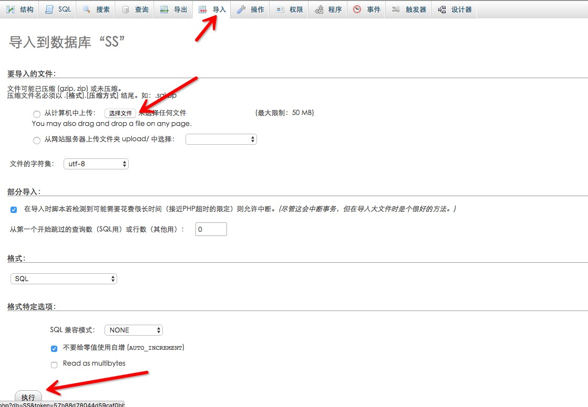

# Shadowsocks 多用户管理系统 — ss-panel 安装教程

## 准备工作
本教程需要一个 VPS、域名、SS-Panel 以及一个有点建站经验的呆逼。

## 安装环境
PHP版本>5.4，而且需要PDO扩展。

这里我使用的是 [lnmp.org](http://lnmp.org/) 一键安装包。

    注意：Lnmp一键包是满足所需条件的，如果是用的其他一键包或者面板请注意这两个要求！如果安装完毕，访问页面出现白屏，那就是php或者pdo版本问题。

## 数据库配置
首先打开 [ss-panel](https://github.com/orvice/ss-panel/tree/v2) 的github页面，将代码 clone 至本地并切到 v2 分支。

```bash
git clone https://github.com/orvice/ss-panel.git
```

打开`ss-panel/sql` 文件夹会看到5个sql文件。

打开网站：`ss.pickerlee.com/phpmyadmin`，输入数据库的用户名`root`和密码`yourpassword`，进去之后点击`数据库`——`新建数据库`——`创建`


选择刚刚创建的数据库`SS`，点击`导入`，然后选择`ss-panel/sql`里面的sql文件，点执行。重复五次，将5个sql文件都导入进去。


导入完成长这个样子


## 网站配置
进入 `ss-panel/lib` 文件夹找到文件 `config-simple.php` 文件，打开并修改数据库配置。

图中红色框内为修改的内容，其中 `DB_USER` 是数据库用户名，`DB_PWD` 是数据库密码，`DB_DBNAME` 是数据库名称。

其中 `$salt` 是加密盐值，随便修改只要不与默认值相同即可。

设置完成后保存文件，并将文件名修改为 `config.php`。

将 `ss-panel` 文件夹上传至服务器的网站文件目录（我的是`/home/wwwroot/default/`）中。


## 防止搜索引擎收录网站
因为SS站比较敏感，为了大家的SS站不被墙发现并封掉，推荐大家做一些防收录措施！

新建`robots.txt`文件，屏蔽搜索引擎蜘蛛爬取网站！

```
Disallow: /user
Disallow: /lib
Disallow: /admin
Disallow: /vendor
 
User-agent: Baiduspider
Disallow: /
User-agent: Sosospider
Disallow: /
User-agent: sogou spider
Disallow: /
User-agent: YodaoBot
Disallow: /
```
然后在`header.php`文件<head>里面加上一个防止百度收录快照的代码：
```html
<meta name="Baiduspider" content="noarchive">
```

    但是百度不一定遵守robots规则，可能依然收录，那就用下面的终极办法！

如果你用的是Nginx，以lnmp为例，那就在`/usr/local/nginx/conf/vhost`文件夹中找到你的域名配置文件，比如：`www.baidu.com.conf`

然后在里面插入以下代码：

```
if ($http_user_agent ~* (baiduspider|googlebot|soso|bing|sogou|yahoo|sohu-search|yodao|YoudaoBot|robozilla|msnbot|MJ12bot|NHN|Twiceler)) {
return 403;
}
```

## 建立完成
这时候网站基本就创建完成了，打开你的域名开启你的网站吧！

    注意：如果安装完毕，访问页面出现白屏，那就是php或者pdo版本问题。

## 其他说明

默认情况下，user表中uid为1的用户为管理员

添加管理员可以在 ‘ss_user_admin’ 表中添加用户UID

默认管理帐号: first@blood.com 密码 1993

## 新版密码加密方式说明

当使用新的加密方式带`salt`的`sha256`加密，由于每个站点的`$salt`值都不同，所以初始密码「1993」是没有用的，安装完成后，访问

你的域名`/pwd.php?pwd=1993`

将获得的字符串更新到数据库`user`表的`pass`字段。

如果正常安装完毕后只有主页能打开，其他页面都是空白，那就是没有修改`config-simple.php`文件名为`config.php`！
